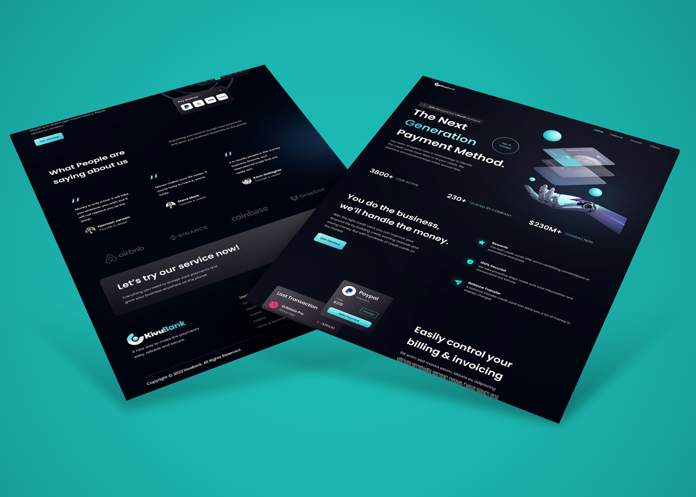

# KivuBank - Modern UI/UX website using React.js & Tailwind CSS

# Introduction
KivuBank is a responsive React JS application consisting of a stunning hero section, high-quality assets and gradients, business stats, reusable feature sections with call-to-action buttons, testimonials, and more!

# Implementation
- React functional components and their reusability
- React file and folder structure
- You’ll achieve mastery using Tailwind CSS
- Fundamental CSS properties to master flex
- From soft and pleasant animations to complex gradients
- Perfectly placed media queries for satisfactory responsiveness on all devices
- And at the end, you'll learn how to deploy your websites to extremely fast servers and give them a custom domain name using Hostinger

 Learn from:
  ⭐ JSM Masterclass Experience - https://jsmastery.pro/masterclass

## React + Vite

This template provides a minimal setup to get React working in Vite with HMR and some ESLint rules.

Currently, two official plugins are available:

- [@vitejs/plugin-react](https://github.com/vitejs/vite-plugin-react/blob/main/packages/plugin-react/README.md) uses [Babel](https://babeljs.io/) for Fast Refresh
- [@vitejs/plugin-react-swc](https://github.com/vitejs/vite-plugin-react-swc) uses [SWC](https://swc.rs/) for Fast Refresh
